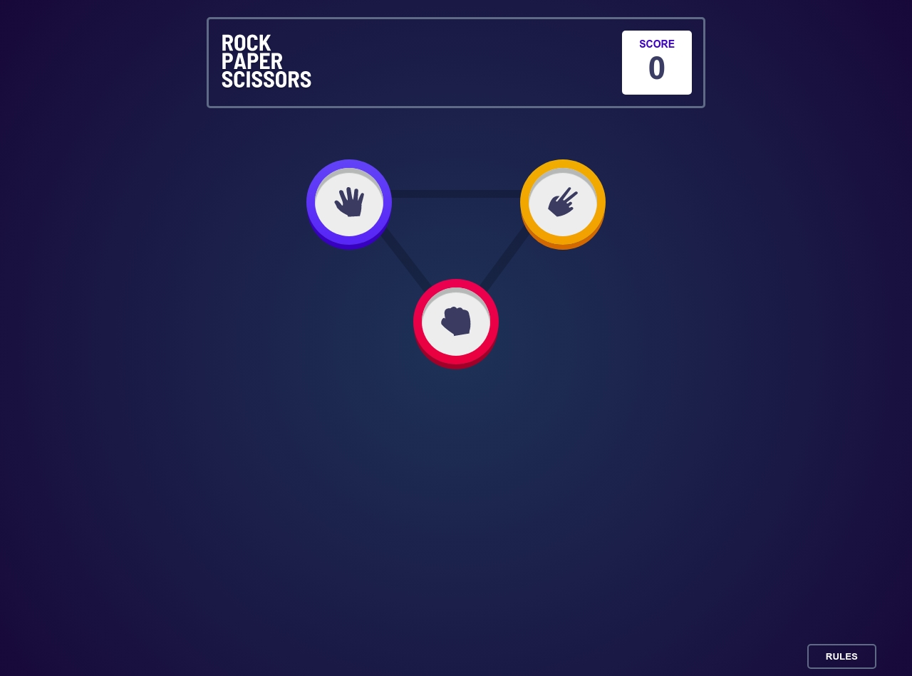
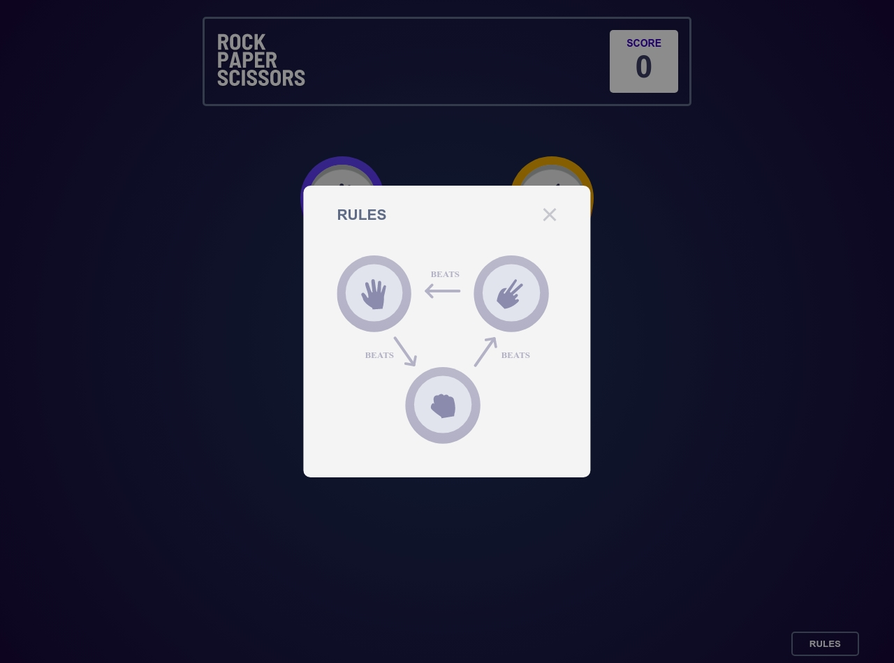
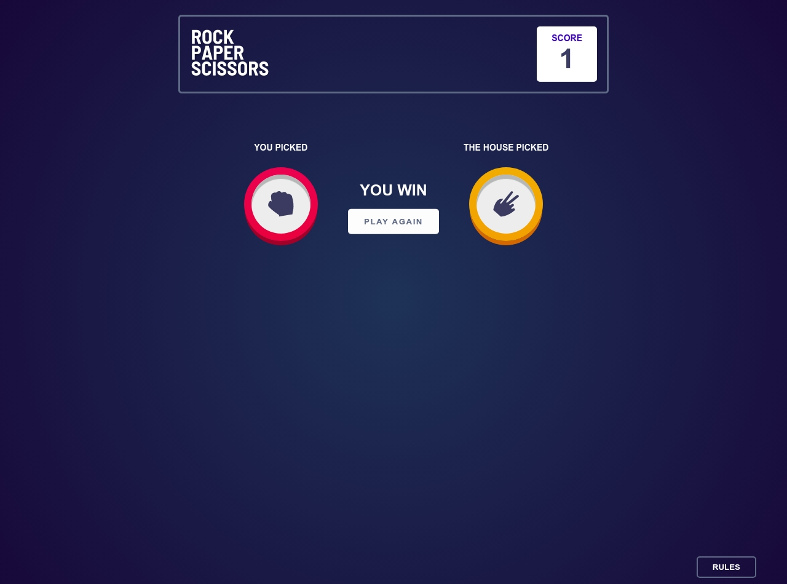
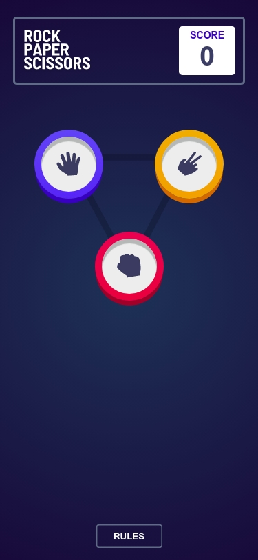
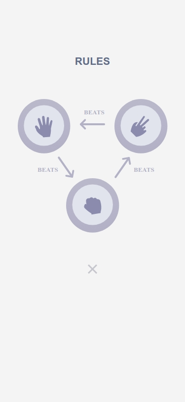
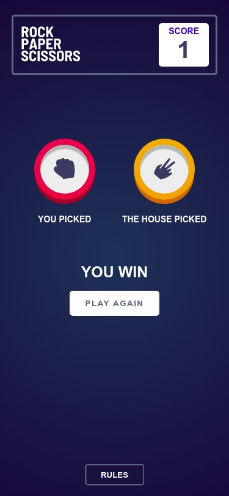

# Frontend Mentor - Rock, Paper, Scissors solution

This is a solution to the [Rock, Paper, Scissors challenge on Frontend Mentor](https://www.frontendmentor.io/challenges/rock-paper-scissors-game-pTgwgvgH). Frontend Mentor challenges help you improve your coding skills by building realistic projects.

## Table of contents

- [Overview](#overview)
  - [The challenge](#the-challenge)
  - [Screenshot](#screenshot)
  - [Links](#links)
- [My process](#my-process)
  - [Built with](#built-with)
  - [Continued development](#continued-development)
  - [Useful resources](#useful-resources)
- [Author](#author)
- [Acknowledgments](#acknowledgments)

## Overview

### The challenge

Users should be able to:

- View the optimal layout for the game depending on their device's screen size
- Play Rock, Paper, Scissors against the computer

### Screenshots

### Links

- [View Code](https://your-solution-url.com)
- [Play Game](https://your-live-site-url.com)

## My process

### Built with

- Semantic HTML5 markup
- SCSS - SASS
- Flexbox
- CSS Grid
- Mobile-first workflow

### Continued development

Still thinking about adding the bonus challenge 🤔

### Useful resources

- [Traversy Media](https://www.youtube.com/user/TechGuyWeb) - I learnt javascript using Brad's YouTube tutorials, and it has proven helpful in this challenge.
- [ResponsivelyApp](https://responsively.app) - This extension helped me in viewing my projects in every viewport which helped improve the responsiveness of the game.

## Author

- Website - [Animashaun Taofiq T.](https://www.github.com/blade-01)
- Frontend Mentor - [@Tobesh01](https://www.frontendmentor.io/profile/Tobesh01)
- Twitter - [@dr_annys](https://www.twitter.com/dr_annys)

## Acknowledgments

Well, I'd like to thank Matt for creating [this](https://www.frontendmentor.io) platform to test my skills and Brad Traversy for his tutorials which has helped me a lot. Gracias 🙇
